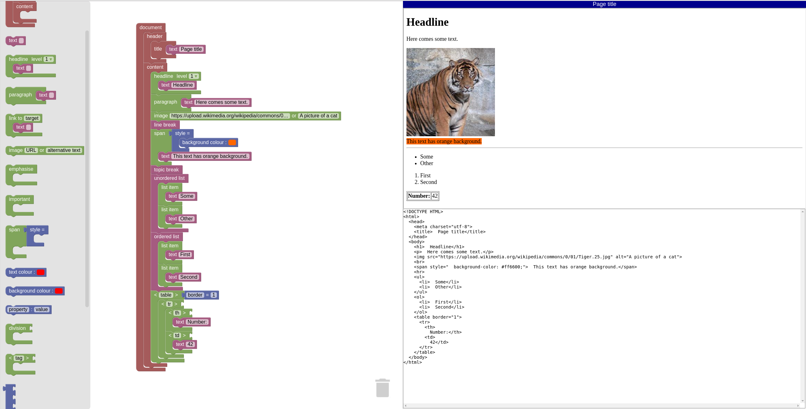

# Blockly-HTML
Blockly blocks and generators for HTML generation and a demo with live preview.

The demo can be tested here: http://blocklyhtml.zgtm.de/

A German demo is available as well: http://htmlbausteine.zgtm.de/

## Try the demo

The files `blockly_compressed.js`, `blocks_compressed.js`, `javascript_compressed.js` and `msg/js/en.js`
of the Blockly repository need to be present in the directory `blockly`.

You can simply checkout the repository https://github.com/google/blockly or unzip https://github.com/google/blockly/archive/master.zip into the directory `blockly`.
Or you can pick the files above manually to create an environment you can distribute without moving the whole Blockly source code around.

The demo saves the workspace in the local browser storage. 
Additionally, it supports importing and exporting blocks (Blockly XML) and exporting the HTML document.

A German localisation of the demo can be enabled by loading `de.js` instead of `en.js` in the header of the HTML file. (This also needs `msg/js/de.js` from Blockly.)

## Library files

The files `library_html.xml` and `library_html_german.xml` are block libraries that can be used to modify the blocks using the Blockly developer tools: https://blockly-demo.appspot.com/static/demos/blockfactory/index.html

## TODO
 * Support more HTML tags and attributes
 * Enforce HTML tag-nesting rules via types
 * Many more …

## Further ideas
 * Maybe support generating other markup languages (Markdown, LaTeX)
 * Add script-tag and allow for standard Blockly blocks in there

