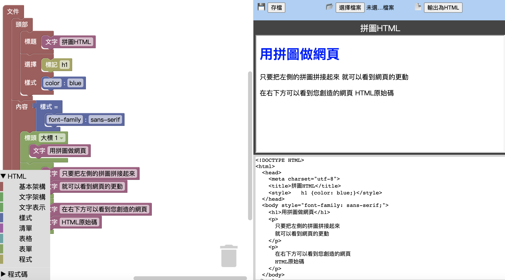

# Blockly-HTML

這個程式可以用區塊拖拉來建構HTML網頁原始碼

Blockly blocks and generators for HTML generation and a demo with live preview.

Blockly-Blöcke und -Generatoren zur HTML-Generierung und eine Demo mit Live-Vorschau.

中文的試用版可以在這裡看到: https://bestian.github.io/blockly-html/demo_zh-hant.html

The English demo can be tested here: https://bestian.github.io/blockly-html/demo_en.html

Eine deutsche Demo ist ebenfalls verfügbar: https://bestian.github.io/blockly-html/demo_de.html

## 測試 / Try the demo / Probieren Sie die Demo aus

來自Blockly資源庫的 `blockly_compressed.js`, `blocks_compressed.js`, `javascript_compressed.js`, `msg/js/zh-hant.js`, `msg/js/de.js` 和 `msg/js/en.js ` 應該要放在 `blockly` 資料夾中

The files `blockly_compressed.js`, `blocks_compressed.js`, `javascript_compressed.js`,  `msg/js/zh-hant.js`, `msg/js/de.js` and `msg/js/en.js` of the Blockly repository need to be present in the directory `blockly`.

Die Dateien `blockly_compressed.js`, `blocks_compressed.js`, `javascript_compressed.js`, `msg/js/zh-hant.js`, `msg/js/de.js` und `msg/js/en.js ` des Blockly-Repositorys müssen im Verzeichnis `blockly` vorhanden sein.

你可以到https://github.com/google/blockly 或者將https://github.com/google/blockly/archive/master.zip 解壓縮成為`blockly`資料夾。你也可以手動複製上述的這些檔案來創造你的開發環境。

You can simply checkout the repository https://github.com/google/blockly or unzip https://github.com/google/blockly/archive/master.zip into the directory `blockly`. Or you can pick the files above manually to create an environment you can distribute without moving the whole Blockly source code around.

Sie können einfach das Repository https://github.com/google/blockly auschecken oder https://github.com/google/blockly/archive/master.zip in das Verzeichnis `blockly` entpacken.
Oder Sie können die obigen Dateien manuell auswählen, um eine Umgebung zu erstellen, die Sie verteilen können, ohne den gesamten Blockly-Quellcode zu verschieben.

範例網頁會將工作區存在瀏覽器的近端儲存區。另外，它也支援匯入和匯出磚磈和匯出HTML檔。

The demo saves the workspace in the local browser storage. 
Additionally, it supports importing and exporting blocks (Blockly XML) and exporting the HTML document.

Die Demo speichert den Arbeitsbereich im lokalen Browserspeicher.
Darüber hinaus unterstützt es den Import und Export von Blöcken (Blockly XML) und den Export des HTML-Dokuments.

將HTML檔頭部的`zh-hants.js`改為`en.js`，即可製作英文的測試版。(也需要Blockly中的`msg/js/en.js`)

A English localisation of the demo can be enabled by loading `en.js` instead of `zh-hants.js` in the header of the HTML file. (This also needs `msg/js/en.js` from Blockly.)

Eine englische Lokalisierung der Demo kann aktiviert werden, indem `en.js` anstelle von `zh-hants.js` in den Header der HTML-Datei geladen wird. (Dies benötigt auch `msg/js/en.js` von Blockly.)

將HTML檔頭部的`zh-hants.js`改為`de.js`，即可製作德文的測試版。(也需要Blockly中的`msg/js/de.js`)

A German localisation of the demo can be enabled by loading `de.js` instead of `zh-hants.js` in the header of the HTML file. (This also needs `msg/js/de.js` from Blockly.)

Eine deutsche Lokalisierung der Demo kann aktiviert werden, indem `de.js` statt `zh-hants.js` in den Header der HTML-Datei geladen wird. (Dies benötigt auch `msg/js/de.js` von Blockly.)

## 資源檔 / Library file / Bibliotheksdatei

這個`library_html.xml`檔案是你可以用來在Blockly開發者工具頁 https://blockly-demo.appspot.com/static/demos/blockfactory/index.html 修改或新增磚塊的資源庫。

The file `library_html.xml` is block library that can be used to modify or add the blocks using the Blockly developer tools: https://blockly-demo.appspot.com/static/demos/blockfactory/index.html

Die Datei „library_html.xml“ ist eine Blockbibliothek, die verwendet werden kann, um die Blöcke mit den Blockly-Entwicklertools zu ändern oder hinzuzufügen: https://blockly-demo.appspot.com/static/demos/blockfactory/index.html

## 錯誤回報與功能請求 / BUG Report & Feature requset / Fehlerbericht & Funktionsanforderung

Please send to https://github.com/bestian/blockly-html/issues 
